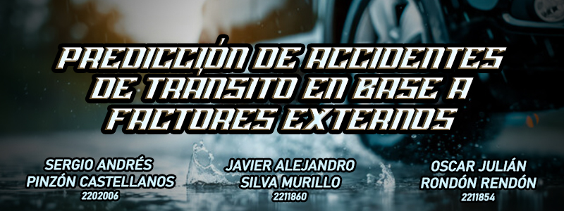

# **Predicción de Accidentes de Tránsito en Base a Factores Externos**

## Autores
Javier Alejandro Silva Murillo, Oscar Julián Rondón Rendón, Sergio Andrés Pinzón Castellanos.

## Objetivo
El objetivo principal de este proyecto es enlistar las posibles causas que llevan a un siniestro vial basándonos en información brindada por las condiciones viales y el tiempo en el que se presentan, para de esa forma predecir que tan riesgoso puede ser el tránsito en ciertas vías de acuerdo a sus condiciones.

## Datasets Utilizados
- **2000-16 Traffic Flow England, Scotland, Wales:** El dataset "Traffic Flow England, Scotland, Wales 2000-2016",  recopila información sobre accidentes de tráfico ocurridos en Inglaterra, Escocia y Gales. El archivo accidents_2012_to_2014.csv se enfoca en los años 2012 a 2014 e incluye datos como fecha, hora, ubicación, tipo de carretera, condiciones climáticas, severidad del accidente, tipo de vehículos y características de las personas involucradas.

Este conjunto de datos permite analizar patrones de accidentes, identificar factores que influyen en su gravedad y desarrollar modelos predictivos para mejorar la seguridad vial. Es útil para investigaciones, diseño de políticas públicas y sistemas de transporte inteligente. Aunque los datos están anonimizados, requieren limpieza y uso responsable para garantizar resultados fiables y éticos.

  **Enlace:** https://www.kaggle.com/datasets/daveianhickey/2000-16-traffic-flow-england-scotland-wales?select=accidents_2012_to_2014.csv

## Modelos Utilizados

1. **Random Forest Classifier:**

- **Uso:** Se utilizó para probar su rendimiento en la clasificación de la gravedad del accidente.
- **Explicación:** Es un clasificador de ensamble que construye múltiples árboles de decisión durante el entrenamiento y genera una salida que es la moda de las clases (clasificación) o la predicción promedio (regresión) de los árboles individuales.

2. **Redes Neuronales Secuenciales (TensorFlow/Keras):**

- **Uso:** Se utilizaron varias configuraciones de redes neuronales para la clasificación de la gravedad del accidente.
- **Explicación:** Son modelos de aprendizaje profundo compuestos por capas apiladas. Las capas densas (Dense) conectan cada neurona de una capa con cada neurona de la siguiente capa. Se utilizan funciones de activación (relu, softmax) para introducir no linealidad.

## Técnicas Utilizadas:

Se utilizaron técnicas de acceso a datos, carga y visualización, análisis de desbalanceo y preprocesamiento que incluyó eliminación de columnas, imputación, codificación y manejo del desbalanceo con **SMOTE**. Se realizó reducción de dimensionalidad con **PCA**, división de datos, normalización, codificación de la variable objetivo y se aplicaron técnicas de regularización y pesos de clase para el entrenamiento de modelos evaluados con classification reports.

## Enlaces
- **Video YouTube:** 
- **Notebook Funcional:** https://colab.research.google.com/drive/15WYAKmIiJDjzWOy6NtofHEFof_Xmf7NL?usp=drive_link
- **Presentación en Canva:** https://www.canva.com/design/DAGpTEDHoOI/U_g7GzT2dzVxaH0xHIAIMQ/edit?utm_content=DAGpTEDHoOI&utm_campaign=designshare&utm_medium=link2&utm_source=sharebutton
